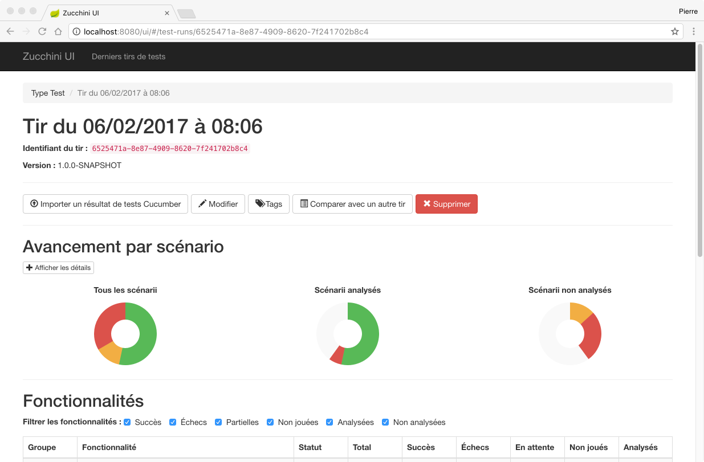

[](https://hub.docker.com/r/pgentile/zucchini-ui)

Zucchini UI
===========

Record and analyze your Cucumber results.




Requirements
------------

### Runtime

* Java JRE 21
* [Mongo](https://www.mongodb.com)


### Development

* JDK 21
* [Node](https://nodejs.org) 20
* [Yarn](https://yarnpkg.com)

Zucchini is built with [Gradle](https://gradle.org/). The Gradle wrapper is provided, no extra download is required.


Build
-----

First time, install Javascript dependencies:

```
npm install --global yarn
./gradlew yarnInstall
```

Build application with Gradle:

```
./gradlew build
```

_Warning_: when Gradle is launched with Intellij, the PATH environment variable doesn't
always contain path to Webpack command. If this is the case, relaunch Gradle daemon:

```
./gradlew --stop
./gradlew build
```


Develop
-------

Run Mongo database server:

```
mongod &
```

Run Mongo migrations to build database:

```
(cd zucchini-ui-mongo && ./migrate.sh MONGO_HOST/MONGO_DATABASE)
```

Import project (on IntelliJ)
* Install gradle plugin
* Restart IntelliJ
* You will see "Import gradle project" message on the right bottom (Event log). Click on it. 
* Select "Use default gradle wrapper". Not "Use local gradle distribution".

Start Java backend:

```
./gradlew runBackend
```

Start frontend:

```
(cd zucchini-ui-frontend && yarn start)
```

Open your browser to (although the `yarn start` should open Zucchini home page) :

```
http://localhost:9000
```

You can build sample Cucumber reports from the `zucchini-ui-example-features`:

```
./gradlew runCucumber
```

Generated reports can be found in `build` directory.

The development UI server runs on port 9000, the backend server runs on ports 8080 (Zucchini API) and 8081
(Dropwizard admin API).

Start Java backend in debug mode
* Open the view "Gradle" > zucchini-ui > other
* Right-click on runBackend
* Debug


Deploy
------

The sub-project `zucchini-ui-app` builds a fat JAR that contains backend and UI in one JAR.
This JAR contains everything needed to run the Zucchini UI app.

You can run it with the following Gradle command:

```
./gradlew runShadow
```

The fat JAR is named `zucchini-ui-app-VERSION-all.jar`. You will find it in `zucchini-ui-app/build/libs`.
Run it with this command:

```
java -jar zucchini-ui-app-VERSION-all.jar server CONFIG.yml
```

Don't forget to init your Mongo database !

```
(cd zucchini-ui-mongo && ./migrate.sh MONGO_HOST/MONGO_DATABASE)
```


Build and deploy a Docker image
-------------------------------

You can build a Docker image:

```
./gradlew dockerBuild
```

The Docker image will be located at `pgentile/zucchini-ui`. After that, you can run the
Docker image and its dependencies with the following command:

```
docker-compose up
```

You can find some pre-built images in [Docker Hub](https://hub.docker.com/r/pgentile/zucchini-ui).


Cypress E2E tests
-----------------

You can launch some E2E Cypress tests:

```
(cd zucchini-ui-e2e-tests && yarn cypress:open)
```

This test suite is useful to validate basic Zucchini functionalities.


Configuration
-------------

The configuration file used by the application is a [Dropwizard YAML file](https://www.dropwizard.io/en/stable/manual/configuration.html).

You can use in your file environment variable, like `${HOME}` or `${USER}`.
View the [sample configuration file](server-config.yml) for more information.


Architecture
------------

Used frameworks:

* UI project: [React](https://facebook.github.io/react/),
  [Redux](http://redux.js.org/),
  [Redux-Forms](http://redux-form.com/),
  [React-Bootstrap](https://react-bootstrap.github.io/)
* Backend project: [Dropwizard](http://dropwizard.io),
  [Spring](http://spring.io), [Morphia](http://mongodb.github.io/morphia/),


Contributing
------------

See the [contributing guide](CONTRIBUTING.md)
